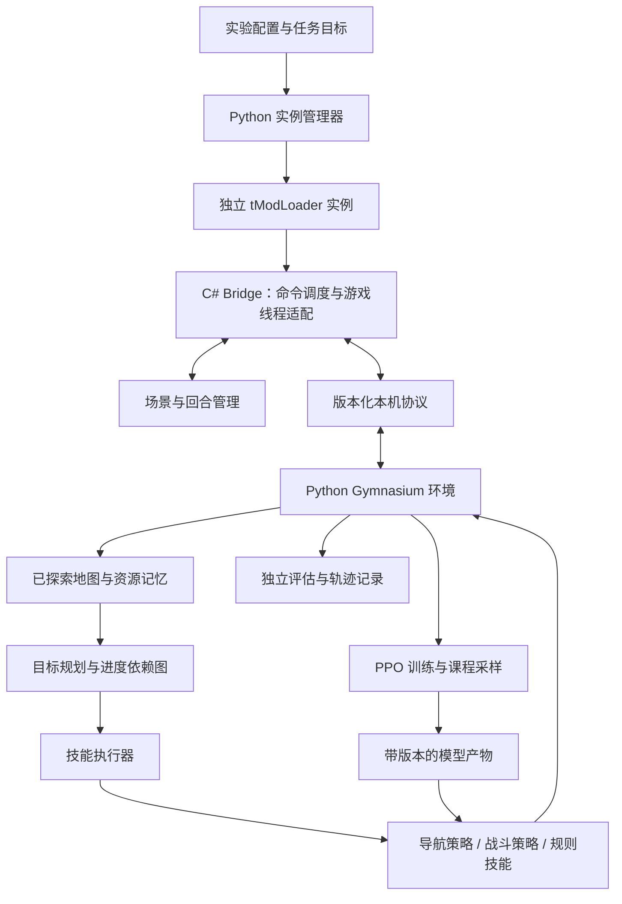
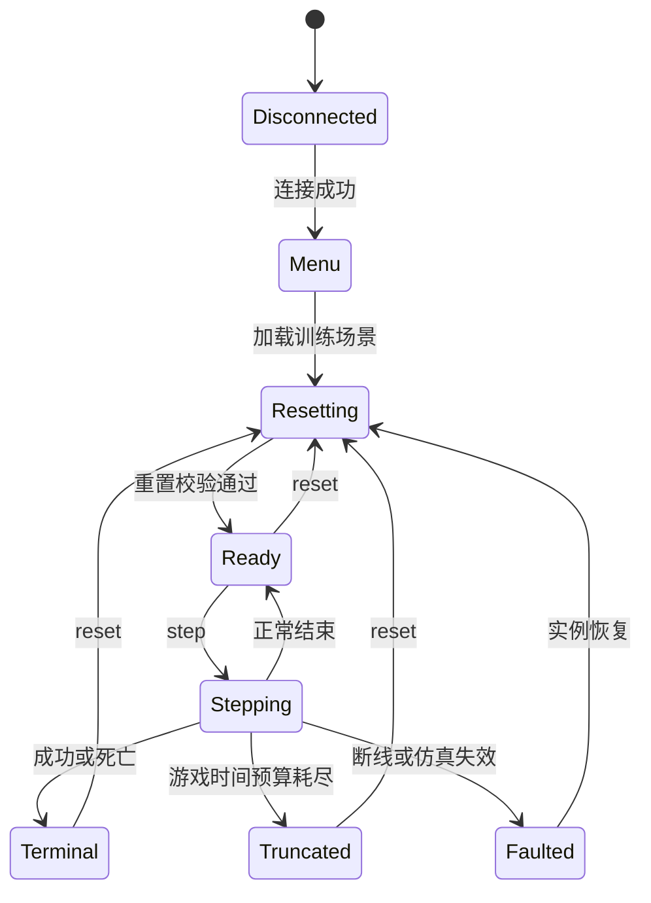

# TerraMaster 完整架构

设计日期：2026-09-09。状态：目标架构；仅“现状”中的能力已经实现。长期目标来自用户：自主探索并最终通关。

## 1. 目标与交付边界

最终交付一个能在新世界自主探索、采集、制作、升级装备、应对战斗并推进至终局的智能体系统。采用“任务规划 + 世界记忆 + 可组合技能 + 强化学习控制”的分层架构。

默认首个完整通关基准：单人、经典角色、普通难度、原版内容加训练桥接模组，以击败月亮领主并核对对应进度事件为成功条件。此为设计假设，可调整；特殊世界种子、专家/大师难度、内容模组与多人合作不在第一版范围。

第一项可交付成果是能在未见过的简单地形到达目标的策略，不把“通信成功”或“固定地图上偶然走到终点”视为训练成功。

两个运行配置共用代码但分开验收：

| 配置 | 用途 | 可用能力 |
|---|---|---|
| Training | 独立训练角色与世界内训练技能 | 场景生成、受控重置、课程采样、评估遥测 |
| Campaign | 从新角色、新世界开始的正式探索与通关 | 正常游戏行动；禁止回档、改生命、传送、生成物品或直接修改进度 |

正式评估默认允许经典角色正常死亡与重生，计入死亡成本和游戏时长；不允许人为接管。自动体训练时的重置便利不能被技能或规划器当作通关能力。

## 2. 现状与关键缺口

| 项目 | 当前证据 | 对后续的影响 |
|---|---|---|
| 游戏桥接 0.3 | 本地 TCP、遥测、限时动作、1/6/15 帧动作实机通过 | 可保留作回归基线 |
| reset | 位置、生命、魔力、朝向恢复通过 | 不是地图或完整玩家快照 |
| 终止 | 死亡转为操作异常 | 尚不能正确采集终止 transition |
| 时间 | 动作结束快照固定，世界在请求之间继续运行 | 精确动作帧数不等于完整同步环境 |
| 观测 | 只有玩家标量 | 不足以学习未知地形导航 |
| Python | 五元组接口，无 Gymnasium space | 尚非标准训练环境 |
| 通信 | 一次连接一条文本命令，仅保留最后结果 | 需完善版本、会话、重试、取消语义 |
| 运维 | 游戏进入世界/模组更新需要人工协助 | 长时间无人值守训练的阻塞项 |
| 训练 | 无模型、训练器、课程或评估器 | 不能声称已开始学习 |

已安装运行时为 Terraria 1.4.4.9 / tModLoader 2026.07.3.0 / .NET 8。本地参考源码 HEAD 为 `97f38fb74d`，targets 使用 .NET 10，不能直接作为稳定版补丁基线。所有涉及游戏循环的改动先对齐已安装版本源码/程序集，再评估 Hook。

## 3. 系统组成



起步只需一个 C# 模组和一个 Python 包，不引入微服务、消息中间件、远程集群或独立数据库服务。模型训练可与游戏同机，之后按实测成本拆分。

| 模块 | 负责 | 不负责 |
|---|---|---|
| BridgeHost | 生命周期、监听、能力声明、请求边界校验 | 场景奖励、策略决策 |
| OperationScheduler | 请求去重、排队、取消、最后帧结果、超时 | 网络线程读写游戏对象 |
| SimulationDriver | 输入生效时机、游戏 tick、控制模式 | 直接优化策略 |
| EpisodeManager | reset 事务、回合状态、死亡/成功事件 | Python 重复实现一套成功判定 |
| Scenario | 地图模板、角色配置、目标、有效区域、种子与重置范围 | 任意存档的通用快照 |
| ObservationBuilder | 同帧快照、局部地形、实体数据、可见性裁剪 | 未探索区域透视 |
| Gym Adapter | space、编码、奖励计算、terminated/truncated 映射 | 操作 Terraria 内存 |
| Planner + Memory | 子目标、依赖、已知地图、失败后重规划 | 每帧瞄准与移动 |
| SkillRunner | 技能参数、开始/完成/失败、超时和抢占 | 擅自使用训练重置作弊 |
| Trainer / Evaluator | 学习、课程、独立评估、模型选择 | 隐式改变测试场景 |
| Supervisor | 专用实例、目录/端口、健康状态、重启、运行清单 | 杀死用户手动启动的无关游戏进程 |

## 4. 时间模型：先解决环境，再扩大训练

支持两个明确声明的模式，不混合比较其分数：

**实时模式（已有原型的延续）**：策略动作执行 k 次控制更新，返回最后一帧快照。记录 actionStartTick、endTick、elapsedTicks、idleTicksBetweenSteps 和 wallClockLatency。空档期间输入归零，仍可能移动或受到攻击。训练按真实经过时间计成本，承认部分可观测和不确定延迟。

**同步模式（优先研究、尚未证明可行）**：READY 时冻结整个仿真，收到动作推进恰好 k 个世界更新，再冻结并返回快照。渲染、网络、取消和看门狗必须保持响应。不能只停玩家、不能在游戏线程等待 socket，也不能只把 Main.gamePaused 当作完整方案。

先做一个有期限的稳定版游戏循环实验。同步模式的证明要求：无动作 1 秒时玩家/NPC/弹幕/时间均不变；执行 k 帧时这些系统协调推进；失焦不改变语义。达不到就将该模式标记 unsupported，继续实时单实例研究，禁止把两者的复现性等同。若实时吞吐不足，优先修复采样路径，再决定是否维护专用源码运行器。

无界面服务器、多开、超实时加速均属于独立研究项。当前依赖 LocalPlayer 与客户端 SetControls，不能直接把 `-server` 当作无界面训练替代品。

## 5. 协议与操作状态

升级为 TCP 上的换行分隔 JSON，保留 0.3 调试客户端直至迁移完成。初期不用共享内存或二进制协议；批量地形/图像成为实际瓶颈后再替换传输层。

请求示例（目标协议，尚未实现）：

```json
{"protocol":2,"sessionId":"instance-a","episodeId":17,"requestId":"req-42","method":"step","params":{"action":2,"frames":6}}
```

完整结果必须包括：协议/模组/游戏版本、sessionId、episodeId、requestId、scenarioVersion、observationVersion、actionSchemaVersion、startTick/endTick、requestedFrames/executedFrames、operationStatus、terminalReason、原始观测与本次游戏事件。奖励权重只由 Python TaskSpec 定义，并记录 rewardVersion。

| 方法 | 约定 |
|---|---|
| hello / capabilities | 声明支持的动作、观测、reset 范围、同步能力与版本 |
| health | 主菜单/加载中/存活/暂停/无更新/错误，分别报告网络和游戏健康 |
| reset | scenarioId + seed + options；完成返回新 episodeId 与初始状态摘要 |
| step | 一个 episode 同时只允许一个操作；末帧或终止帧生成结果 |
| result | 在有界缓存中读取同一不可变结果 |
| cancel | 仅取消指定 requestId；旧客户端不能取消新回合的动作 |
| release / close | 归零输入并释放控制权，默认不关闭非托管游戏 |

同一 requestId、同一参数重试返回原结果；同 ID 不同参数报冲突；缓存淘汰后返回明确 unknown，不重新执行。连接恢复先握手检查 session，禁止重新提交已经执行的动作。一个 session 只允许一个拥有控制租约的客户端，其他连接可只读。使用 loopback 绑定与每实例随机令牌，防止误连多开的另一个实例。

帧预算、仿真时间上限和墙钟看门狗分开。解析要求整条消息换行到齐、限长、限读总时长；半条命令不能执行。运行中的 reset 与 step 必须互斥。

## 6. 回合与重置



重置采用“有限场景可完全定义、可验证”的设计：

1. 专用世界模板与专用角色模板带标记、版本和哈希，放入工作区 runs 目录。拒绝修改没有训练标记的普通存档。
2. 场景声明地图边界、初始装备、角色属性、Buff/冷却、出生点、目标、NPC/弹幕/掉落物、天气/时间与允许的游戏机制。
3. 先停止控制和场景演化，清理场景所有实体与临时物件，恢复玩家及场景状态，再读取初始观测。
4. 核对 reset checksum；不一致时整个回合失败，不在部分成功的状态下继续训练。
5. 先用模板重新加载作为正确性基线；测得慢以后实现受限区域原地重建。原地重建结果必须与基线一致，液体、线路、全局进度等跨区机制初期排除。
6. 死亡必须先保存终止帧的观测和事件，再通过训练专用的受验证复活/角色重建路径开始新回合。禁止简单改 dead=false 假装完成复活。

seed 分成场景布局种子、游戏随机性种子、策略种子、训练器种子。`super().reset(seed=seed)` 只初始化 Python 环境 RNG，不证明 Terraria 全部随机源可复现。定义 reset-state checksum、关键状态轨迹 checksum 和统计复现三个不同层级。

## 7. 观测与动作

初期使用结构化游戏状态，后期另设纯视觉实验，不把图像采集成本提前加入导航闭环。

建议 observation_space 为 Dict：

| 键 | 初始规格建议 | 说明 |
|---|---|---|
| player | float32 固定长度向量 | 相对速度、生命比例、落地、朝向、控制冷却；明确单位和范围 |
| terrain | 5×21×31 局部网格 | 实心、平台、危险、液体、已知/可见掩码；处理斜坡/半砖或明确场景禁用 |
| goal | float32 相对目标向量 | 只对任务已知目标给方向和距离 |
| entities | K×D + mask | 战斗阶段加入，按稳定规则排序、截断并报告溢出 |
| inventory | 后期加入固定资源槽/类型嵌入 | 数量、装备、可用工具、消耗品 |

第一版局部网格用简单碰撞通道，保留 unknown 与 empty 的区别。裁剪范围不等于可见性；定义并测试游戏内感知范围、遮挡和已探索记忆。训练诊断可读全局真值，但不能泄漏进 Campaign 的策略输入。评估区分“局部状态辅助”与“纯视觉”，不宣称两者能力相同。

阶段一使用 Discrete(6)：idle、left、right、jump、left_jump、right_jump，初始 action repeat=6，战斗时另行测试 1–3 帧。不要过早扩大为所有按键的笛卡尔积。

战斗升级为移动/跳跃、瞄准方向或目标、攻击/物品槽组成的动作 schema。采矿、放置、制作加入有效距离、碰撞、背包容量、工具强度和材料检查；通过正常游戏行为完成，不能直接发放物品或修改敌人生命。不同技能可以使用不同动作空间，统一由 ActionAdapter 校验。

## 8. 层级决策与自主探索

高层以事件或技能结束为决策点，不以每游戏帧调用规划器。默认用可检查的任务依赖图和规则规划器；LLM 可作为后续候选规划组件，不是基础依赖，不在动作热路径中调用。

世界记忆分成：已探索区域的地形摘要、基地/矿点/危险区等语义地点、资源与装备状态、进度事件、失败记录。记录信息年龄与置信度；路线失效或目标资源耗尽时重新观测。

统一技能契约：`start(goal, constraints) -> running -> success | failure | timeout | interrupted`。携带允许动作、最大游戏时长、所需资源、预期结果、失败原因与可恢复策略。

| 技能 | 首选实现 | 升级方向 |
|---|---|---|
| MoveTo / Traverse | 局部 PPO + 已知地图路径规划 | 局部记忆、复杂地形课程 |
| Avoid / Fight | 单敌人/单武器专用策略 | 弹幕、装备变化、Boss 技能族 |
| Explore | 基于已知地图选择探索边界，调用 MoveTo | 风险/资源收益估计与学习式子目标 |
| Gather | 目标定位、导航、工具使用状态机 | 受控挖掘和动态路线 |
| Craft / Equip / Store | 带前后置条件的确定性执行器 | 资源预算优化 |
| Progress | 版本化依赖图选择下一里程碑 | 战略选择与高层策略学习 |
| Recover | 正常重生、撤退、补给、重新规划 | 失败原因驱动的课程补充 |

通关推进图先按“基础生存与基地 → 资源/装备循环 → 前期 Boss 阶段 → 困难模式转换 → 后期装备与 Boss 阶段 → 终局”建模。具体配方、召唤条件与进度边要从锁定版本游戏数据验证，不凭记忆写死完整流程。达到高层目标须由游戏事件和实际背包/进度变化确认。

## 9. 奖励、训练与课程

推荐首个学习基线为 SB3 PPO；简单向量先 MLP，加入地形网格后用小型 CNN 与标量编码拼接。先测 CPU；当前显卡主要为后续图像/网格编码和批量优化提供余量，不能补偿低游戏采样速度。

课程建议：平地到达 → 小台阶/坑洞 → 随机可达地形 → 无战斗探索 → 采集返回 → 单敌人 → 武器与敌人变化 → 局部资源循环 → 分阶段 Boss → 跨阶段自主推进。规划器可在底层技能成熟前用规则控制器做集成测试。

导航第一版奖励是可调起始方案：到达一次 +1，死亡/任务失效 -1，每经过一个游戏 tick 收取小时间成本，加目标距离的势函数差。势函数使用和训练算法一致的 gamma，终止处理单独校验；测试来回移动、跳跃原地刷分、反复重置、重复到达目标等投机轨迹。

探索奖励按新区域首次有效发现计数，重复访问不刷分；采集按实际净资源收益；战斗按有效伤害、受伤、完成任务计分。高层阶段奖励按真实进度事件一次发放。奖励分项和终止原因必须进入轨迹。

成功/死亡属于 terminated；有效观测下达到回合时间上限属于 truncated；断线、未知状态、reset 失败属于基础设施故障，丢弃受影响 transition、恢复实例并记录，不伪装成死亡惩罚或成功。终止中断动作时允许 executedFrames < requestedFrames，保留终止观测。固定帧长度先减少变步长复杂性；高层技能耗时另计。

## 10. 评估与验收

分离训练、验证和测试的布局/世界种子；调参只看验证集，正式测试集固定后不反复据其分数调参。学习基线至少 3 个训练种子，报告每个种子的结果、均值和区间。

每次模型升级对比 random、规则控制器和上一版本模型；记录成功率、死亡率、游戏 tick 时长、墙钟时长、技能失败分布、受伤、样本吞吐和恢复次数，不只看累计 reward。

最终 Campaign 用干净角色和世界，不加载训练用库存，不回滚失败；报告成功世界数/总世界数、死亡数、完整进度事件链、人工干预数、存档摘要和录像。一次演示成功与稳定通关能力分别报告。

版本不匹配的模型不能静默加载：model manifest 绑定游戏版本、模组哈希、观测/动作 schema、归一化统计、scenario/reward 版本和训练配置。评估冻结归一化统计，不能用测试数据继续训练。

## 11. 实验与运行管理

推荐目录（逐阶段迁移，不立即创建空模块）：

```text
TerraBridge/                 C# 模组
  Runtime/                  生命周期、仿真驱动、输入
  Protocol/                 DTO、调度、结果缓存
  Scenarios/                模板、回合、重置
  Observations/             快照与可见性
src/terramaster/
  bridge/                   协议客户端与错误类型
  envs/                     Gym 适配、观测编码、奖励
  skills/                   导航、战斗、规则技能
  planning/                 目标依赖图、探索、世界记忆
  training/                 PPO、课程、检查点
  evaluation/               种子集、基线、报告
  runtime/                  实例管理、健康检测、恢复
configs/                    scenario / train / eval 配置
tests/                      契约、场景、实机回归
doc/                       协议与后续设计决策
assets/scenarios/           模板清单与生成定义
runs/<run-id>/              配置快照、事件、指标、失败轨迹
models/<model-id>/          权重与版本清单
```

当前根目录脚本先保留兼容入口。控制 demo 与新协议集成测试分开标版本（`verify_controls.py` 已对齐 0.3，`verify_steps.py` 对齐 0.3）。默认记录结构化轨迹；按失败和抽样回合录制视频，不将全部逐帧 JSON 永久保留。

本次实测硬件：Ultra 7 270K Plus，24 逻辑处理器，约 47.5 GiB RAM，RTX 5090 D v2，nvidia-smi 报 24455 MiB 显存。未测 CUDA/PyTorch 兼容性，未测多开吞吐。不要使用 Win32_VideoController 的 AdapterRAM 推断这张卡显存。

以 60 游戏 tick/s、每动作 6 tick 作理想估算，单实例最多约 10 transition/s，百万 transition 仅采样就需约 27.8 小时；重置、通信、训练会再增加耗时。此为算术估计，不是跑分。目标是先测实际吞吐，再按固定预算决定训练步数、并发数和是否值得研究加速。

## 12. 关键风险与决策

| 风险 | 先验证什么 | 后备路线 |
|---|---|---|
| 稳定版无法可靠同步推进 | 整世界暂停/恢复与 tick 测试 | 明确实时模式；必要时研究专用源码运行器 |
| reset 遗留状态 | 与模板加载对照、连续重置 checksum | 保留慢但正确的模板加载路径 |
| 失焦/多实例不工作 | 后台持续更新、实例隔离 | 单实例可视训练，不提前上并行 |
| 样本过慢 | 实测 tick/s、transition/s、reset p95 | 小任务、小策略、示范数据，优化后再扩大 |
| 状态泄漏导致虚假探索 | 可见性遮挡测试、策略输入审计 | 局部状态辅助基准单独标注 |
| 奖励投机 | 固定恶意轨迹和规则基线 | 简化奖励、真实进度事件计分 |
| 跨技能失败累积 | 技能前后置条件与长轨迹回放 | 显式重规划、恢复与局部课程 |
| 游戏更新破坏 Hook | 游戏/模组版本绑定与实机 smoke test | 冻结已验证版本，单独迁移 |

## 13. 资料与依据

- 本地 `../README.md`、`../TerraBridge/*.cs`、`../terra_env.py`、`../step_verification.json`：当前能力与边界。
- [tModLoader ModSystem 稳定版文档](https://docs.tmodloader.net/docs/stable/class_mod_system.html)：系统级 Hook 入口；不据此宣称存在同步暂停接口。
- [Gymnasium Env API](https://gymnasium.farama.org/api/env/)：step/reset、space、seed 与终止/截断契约。
- [SB3 2.7.1 自定义环境](https://stable-baselines3.readthedocs.io/en/v2.7.1/guide/custom_env.html)：环境适配与检查工具。
- [SB3 2.7.1 PPO](https://stable-baselines3.readthedocs.io/en/v2.7.1/modules/ppo.html)：候选训练器、观测/动作空间与设备选择。引用版本供设计核对，实际安装版本在首个兼容性 smoke test 后锁定。
