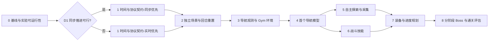

# TerraMaster 执行计划（详尽开发版）

日期：2026-09-09。对应 [完整架构](ARCHITECTURE.md)。本文是执行路线，**不表示这些功能已实现**；当前仅桥接原型 0.3 已实机验证。长期目标为自主探索并最终通关：先把可学习、可重置、可测量的环境做稳，再组合技能形成完整智能体。

> 本文把每个里程碑拆到任务级，并纳入架构评审结论（同步推进可行性提前闭环、死亡终止语义作硬门槛、重置以模板重载为正确性基线）。计划与实测严格分开，任何"已实现"必须挂实机/测试证据。

## 0. 读法与更新约定

- 每个里程碑给出：目标、任务清单（T 编号）、完成证据、依赖、验收门槛、风险与后备。
- 门槛是"反造假"式硬指标：通过即通过，不通过不降标准；若实测证明门槛成本不合理，用证据调整并在文档记录，不悄悄降低。
- 三个前置技术决策（D1–D3）先于里程碑展开，因为它们会改变下游架构和投入优先级。
- 版本管理：协议 / 模组 / 观测 schema / 场景 / 奖励 / 模型分别版本化；接口变更同步客户端、验证脚本和文档；版本不兼容明确报错。

## 1. 交付顺序与决策门槛

下面工程量是单人等效工程投入估计，含实现、联调和验收，不含模型采样等待、用户进出游戏等待、失败研究返工。门槛为建议目标，先按目标执行；若成本不合适以实测证据调整，不悄悄降低标准。

| 阶段 | 主要交付物 | 建议验收门槛 | 预计工程量 |
|---|---|---|---|
| **D1** 同步实验 | 整世界冻结/推进证据或不可行结论 | 有可复现实测证据，或明确列缺口并判 unsupported | 2 工程日（时间盒） |
| M0 基线 | 环境清单、兼容锁定、独立实验目录、doctor/bench | smoke tests 可重跑；单实例前后台 30 分钟稳定；记录真实吞吐/延迟 | 1–2 天 |
| M1 控制语义 | 协议 v2、操作状态机、时间模式 | 1000 次混合帧数请求无串帧；重试/取消/断线不重复动作；模式可机读 | 3–5 天 |
| M2 回合环境 | 专用角色/世界、导航场景、成功/死亡/超时/重置 | 连续 100 回合 reset 校验通过；含死亡和场景污染用例；死亡产生合法终止 transition | 4–7 天 |
| M3 Gym 与观测 | 局部地形、动作 schema、标准 Env、规则基线 | space/check_env 通过；规则导航完成可达场景；终止 transition 正确 | 2–4 天 |
| M4 导航模型 | PPO 训练脚本、模型清单、独立评估报告 | 3 训练种子；固定测试集各 100 回合，平均成功率 ≥90% 且明显优于随机 | 3–5 天 + 采样 |
| M5 探索与采集 | 地图记忆、探索边界、挖掘/拾取/返回 | 20 个未见世界完成指定资源收集并返回基地 ≥80%；人工干预 0 | 5–10 天 + 训练 |
| M6 战斗 | 瞄准攻击、单敌人训练、武器与敌人课程 | 固定装备下独立单敌人测试集成功率 ≥90%；统计受伤和死亡 | 5–10 天 + 训练 |
| M7 资源与进度循环 | 制作/装备/储存、前置条件图、恢复与重规划 | 基础装备自主完成资源→制作→作战准备链，20 次成功 ≥80% | 5–10 天 |
| M8 Boss 与 Campaign | 阶段 Boss 技能、完整推进、干净世界评估 | 先报告首次无人工干预通关；再在预登记 10 世界报告成功率、区间和失败阶段 | 分阶段研究，不承诺固定日期 |

M0–M4 合计约 13–23 个工程日（含 D1 的 2 天），是首个导航闭环的规划量级，不是"最终通关需几周"的承诺。M5/M6 可在接口稳定后独立排程，但本计划不默认创建并行代理或占用多实例。

## 2. 三个前置技术决策（评审结论）

### D1 同步推进可行性（最高优先级，提前到 M0 末 / M1 初）

同步模式决定下游是否成立：同步可行 → 确定性环境、seed 可复现、reset checksum 有强语义；不可行 → 实时单实例、约 10 transition/s 上限、百万样本纯采样约 27.8 小时，"可复现"只能退化为"统计复现"。

**结论先于协议 v2 的 DTO/缓存投入闭环**：协议 v2 本身不依赖同步结论，但投入优先级应被其重排。

- 时间盒：2 个工程日，产出可复现的实测证据。
- 证明要求（来自架构 §4）：无动作 1 秒时玩家/NPC/弹幕/时间均不变；执行 k 帧时这些系统协调推进；失焦不改变语义。
- 不得把 `Main.gamePaused` 当作完整方案，不得只停玩家、不得在游戏线程等待 socket，渲染/网络/取消/看门狗必须保持响应。
- 失败即判 unsupported，继续实时单实例研究，禁止把两者的复现性等同；若实时吞吐不足，在 M4 前重新决策专用运行器或示范数据路线。

### D2 死亡 → terminated 语义（M2 硬门槛）

当前死亡走 `player_unavailable` 异常路径（`TrainingOperations.cs`），Python `step()` 的 `terminated` 实际永远到不了 True。**在 M2 交付合法终止 transition 之前，不启动任何训练**，否则死亡被当成基础设施故障丢弃，样本分布系统性偏向"没死"轨迹。

- 死亡必须先保存终止帧观测和事件，再通过训练专用、受验证的复活/角色重建路径开新回合。
- 禁止 `dead=false` 假装复活；成功/死亡属 terminated，时间上限属 truncated，断线/未知状态/reset 失败属基础设施故障并丢弃受影响 transition。

### D3 重置正确性基线（模板重载优先，原地重建后置）

重置采用"有限场景可完全定义、可验证"设计。**先用模板重载作为正确性基线，测得慢以后再实现受限区域原地重建**，且原地重建结果必须与基线一致。液体、线路、全局进度等跨区机制初期排除。

- 场景声明地图边界、初始装备、角色属性、Buff/冷却、出生点、目标、NPC/弹幕/掉落物、天气/时间与允许机制。
- reset 完成核验 checksum；不一致则整回合失败，不在部分成功状态下继续训练。
- 拒绝修改没有训练标记的普通存档。

## 3. M0：建立可重复的开发基线

2026-09-10 切片进展：T0.1 已初始化 Git 和忽略规则，原型基线提交为 `e97883b`；T0.2 已采集安装版运行清单及 SHA-256，未证明磁盘包与当前源码/已加载包完全对应；T0.3 已建立标准库专用环境和空第三方依赖锁，训练栈 smoke 未做；T0.4 已有只读 doctor（训练标记与 CUDA 明确 unknown/not_tested）；T0.5 已有被动 bench，实测约 59.93 tick/s，主动 transition/reset/内存尚未测。T0.6、T0.7 和 30 分钟门槛尚未验收。证据与限制见 [baseline-report.md](baseline-report.md)。

**目标**：任何一次原型回归都能在干净环境重跑，且拿到真实吞吐/延迟数字。

| 任务 | 内容 | 完成证据 |
|---|---|---|
| T0.0 | 修复 `verify_controls.py` 版本检查 0.2→0.3（**本次已完成**） | 脚本等待 `version == "0.3"`，与模组 `ping` 返回值一致 |
| T0.1 | 建立 Git 版本管理与忽略规则，记录 0.3 基线 | `.gitignore` 排除运行存档、模型、缓存和大日志，保留小型验证证据；首次提交可追溯 |
| T0.2 | 固定 tModLoader 运行版本；建立稳定版源码/程序集/开发引用对应关系 | `runtime-manifest.json` 记录游戏/模组/.NET 版本、模组哈希、构建方式；不修改参考源码分支 |
| T0.3 | 建立 Python 专用虚拟环境与依赖锁 | 依赖锁文件；Gymnasium/SB3/PyTorch 组合跑通小型 CPU smoke test，CUDA 另测 |
| T0.4 | `doctor` 命令 | 报告版本、端口、游戏状态、训练标记、最近 tick、依赖、设备，异常项可机读 |
| T0.5 | `bench` 命令 | 实测 tick/s、transition/s、step p50/p95、reset 时间、内存；无动作 1 秒世界继续推进的观测证据 |
| T0.6 | 专用 save/profile 路径隔离 | 训练专用角色/世界与普通存档物理隔离，路径写清单；启动参数查稳定版入口，不猜 |
| T0.7 | 补齐原型暂停/超时验收 | 5 秒超时分支实机验收（README 标注"尚未做实机暂停验收"的缺口关闭） |

**验收门槛**：当前 smoke tests 可重跑；单实例前后台 30 分钟稳定；`baseline-report.md` 记录真实吞吐/延迟，作为后续样本预算的输入。

## 4. M1：明确时间和协议

**先完成 D1（同步实验）**，再按结论排序 T1.2–T1.5 的投入。

| 任务 | 内容 | 完成证据 |
|---|---|---|
| T1.1（=D1） | 同步模式技术实验，研究期限 2 工程日 | 整世界冻结/推进证据，或不可行结论和明确缺口 |
| T1.2 | 协议 v2 DTO、版本/能力、request/session/episode 标识 | 固定 JSON 契约样例；不完整/超长消息拒绝；半条命令不执行 |
| T1.3 | 有界结果缓存、幂等请求、参数冲突、定向取消 | 同 ID 同参重传返回原结果；同 ID 异参报冲突；缓存淘汰返回 unknown；旧请求不能取消新回合动作 |
| T1.4 | 分离游戏帧预算、真实耗时和墙钟 watchdog | 失焦、暂停、短帧、长帧、取消回归通过 |
| T1.5 | 实时模式记录起止帧和空档、默认归零输入 | 无隐含持续动作；观测含 actionStartTick/endTick/elapsedTicks/idleTicksBetweenSteps/wallClockLatency |
| T1.6 | （视 bench）持久连接，替换每命令一连接 | 若实测 socket 开销不可忽略才做，否则延后 |

**验收门槛**：1000 次混合帧数请求无串帧；重试/取消/断线不重复动作；模式可机读。同步研究失败不阻止实时环境接口完善；若最终实时，所有训练报告注明模式并报告空档延迟，不得写"确定性仿真"。

## 5. M2：独立导航场景和可靠 reset

首个场景为封闭、有限大小的平地/台阶导航区，**无自然刷怪**、无液体/线路/天气、不允许采矿。目标随机但保证可达；训练/测试布局种子分离。

| 任务 | 内容 | 完成证据 |
|---|---|---|
| T2.0 | 新建 `ScenarioDefinition`，明确允许变化的状态、初始状态和版本 | 场景版本号与 checksum 定义 |
| T2.1 | 专用模板加载作重置基线（D3 硬门槛） | 不依赖普通世界 checkpoint；模板加载后 reset 校验通过 |
| T2.2 | 回合结果：目标/死亡/越界/最大 tick 预算 | 死亡/成功后原回合禁止继续 step |
| T2.3 | 死亡终止观测 + 角色重建/复活 + 状态校验（D2 硬门槛） | 校验 Buff、冷却、抓钩、坐骑、弹幕、掉落物、生命/魔力/装备等场景相关状态；产出合法 terminated transition |
| T2.4 | reset 原子性与世界隔离故障测试 | 中途断线、非法种子、普通世界调用、阻塞出生点、上一回合遗留实体 |
| T2.5 | 刷怪抑制验证 | 场景内自然刷怪确实为 0（显式抑制 spawn，不靠"没写逻辑"） |
| T2.6 | （后置）原地重建优化，与模板基线对比 | 两种路径初始状态摘要一致后才切换 |

**退出条件**：100 次混合回合全部成功重置，其中至少 20 次死亡或失败终止；普通世界拒绝训练 reset；死亡产出合法终止 transition。耗时只测量，暂不为速度牺牲正确性。

## 6. M3–M4：标准环境和首个模型

### M3 顺序

| 任务 | 内容 |
|---|---|
| T3.0 | terrain/player/goal 三类输入，固定 dtype、shape、归一化、unknown 掩码与可见性测试 |
| T3.1 | 真正 `gymnasium.Env`：`reset(seed, options)`、space、`close()`、必要 render 能力 |
| T3.2 | 终止/截断映射、终止观测、基础设施错误恢复；同步未证明时不伪造 seed 确定性检查 |
| T3.3 | 随机策略和规则策略，确认任务可完成、奖励合理；测试原地跳、往返、重复达标等投机行为 |
| T3.4 | 标准环境检查器（check_env）和自有时间/场景契约测试通过 |

### M4 实验顺序

| 实验 | 目的 | 继续条件 |
|---|---|---|
| 10k transition smoke | 检查训练循环、有限数值、模型保存/加载与回合恢复 | 无异常样本、无 reset 漏洞 |
| 100k pilot | 看是否优于随机，发现奖励或观测问题 | 可解释的性能提升，否则先分析轨迹 |
| 预算约束的正式训练 | 3 训练种子、固定配置、完整测试 | 达到 M4 门槛；不只展示最佳种子 |

PPO 起始参数用已锁定库的常规设置并落盘；优先调动作周期、观测、场景难度和奖励，不盲目大范围搜超参数。`n_steps×n_envs`、`batch_size`、归一化状态均记录。小型向量策略先测 CPU 再定设备。

**样本预算**（用 M0 实测吞吐重算）：`采样小时 = transition 数 / 实测 transition/秒 / 3600`，再加评估、重置和训练优化耗时。单实例每动作 6 tick、假设 60 tick/s 时，100k 纯采样理想下限约 2.8 小时，1M 约 27.8 小时——这是算术估计不是跑分。大规模试验先给出具体算力/时间预算。

模型产物含权重、训练配置、游戏/模组版本、schema、归一化状态、种子集、指标和失败样例。测试场景不得用于调参。

## 7. M5–M8：逐步形成自主通关能力

**M5 自主探索与采集**：局部观测写入带 unknown 掩码的地图记忆；优先探索可达边界、记录危险区；目标为获得指定资源并返回基地。先规则挖掘/拾取闭环，再决定哪些动作值得强化学习。资源评价基于净新增数量，禁止反复丢弃拾取刷奖励。

**M6 战斗**：封闭场景单敌人起步，固定武器与装备；加入可见实体相对状态、瞄准和攻击。先简单追踪/躲避控制器再训练策略。移动与战斗可复用编码，但避免共享权重更新破坏已通过的导航策略。

**M7 资源循环与规划**：版本化配方/装备/进度依赖图，定义 gather/craft/equip/store 前后置条件；技能成功由实际游戏状态验证。资源不足、路线阻塞、意外死亡都返回结构化失败，规划器负责撤退/补给/重选目标。

**M8 分阶段通关**：每个 Boss 阶段单独建立入场条件、装备基准、训练场景、成功事件和恢复策略；先各阶段独立门槛，再从新角色新世界串联。自然流程的准备时间与资源获取计入总成本，预配终局装备的战斗成功不算通关成功。

高层初版为可检查的依赖图/规则规划器；有足够执行轨迹后再比较学习式调度或 LLM 规划。失败日志显示行动可靠性瓶颈则强化技能，显示目标选择错误则优化战略层。

## 8. 测试、观测与发布节奏

| 层级 | 检查内容 | 触发条件 |
|---|---|---|
| 快速契约测试 | 消息解析、幂等、schema、奖励/终止、配置 | 对应模块变动 |
| 离线轨迹回放 | 编码、奖励重算、规划前后置条件 | 观测/奖励/规划变动 |
| 单实例实机 smoke | 启动、reset、step、death、stop、退出世界 | C# 或协议变动 |
| 场景压力测试 | 100 回合重置、超时、实例恢复 | 场景/运行器发布 |
| 模型回归 | 固定测试集与旧模型/规则基线比较 | 模型晋级 |
| Campaign 验收 | 干净世界、无人工干预、进度全链 | 通关版本发布 |

每个阶段生成"已实现、未实现、证据、失败风险、下一阶段入口"报告。模型与模组分别版本化；发布前加载检查拒绝不兼容组合。运行器仅管理自己启动并登记 PID/路径的实例，异常恢复不操作用户其他存档。

多实例是 M4 后的性能决策：先证明两实例前后台稳定和完全隔离，再考虑四实例；依据吞吐、p95 和内存选择数量，不按 24 核默认开 24 个游戏。训练包复用稳定 Gym 接口，不立即编写自定义分布式训练框架。

## 9. 风险清单与后备（按评审重排）

| 优先级 | 风险 | 先验证什么 | 后备路线 |
|---|---|---|---|
| 1 | 稳定版无法可靠同步推进 | 整世界暂停/恢复与 tick 测试（D1） | 明确实时模式；必要时研究专用源码运行器 |
| 2 | reset 遗留状态 / 死亡语义缺失 | 与模板加载对照、连续重置 checksum、死亡终止 transition（D2/D3） | 保留慢但正确的模板加载路径 |
| 3 | 失焦/多实例不工作 | 后台持续更新、实例隔离 | 单实例可视训练，不提前上并行 |
| 4 | 样本过慢 | 实测 tick/s、transition/s、reset p95 | 小任务、小策略、示范数据，优化后再扩大 |
| 5 | 状态泄漏导致虚假探索 | 可见性遮挡测试、策略输入审计 | 局部状态辅助基准单独标注 |
| 6 | 奖励投机 | 固定恶意轨迹和规则基线 | 简化奖励、真实进度事件计分 |
| 7 | 跨技能失败累积 | 技能前后置条件与长轨迹回放 | 显式重规划、恢复与局部课程 |
| 8 | 游戏更新破坏 Hook | 游戏/模组版本绑定与实机 smoke test | 冻结已验证版本，单独迁移 |
| 9 | 人机耦合阻塞长时间训练 | 前后台稳定、doctor 自检、Supervisor 实例管理 | 无人值守前先跑通 30 分钟稳定 + 单实例全程 |

## 10. 下一次实际开发的任务包（立即执行清单）

从 **D1 + M0 + M1 的最小切片** 开始，避免一口气重写原型：

1. **已完成**：修复 `verify_controls.py` 版本检查（0.2→0.3）。
2. 将当前代码纳入版本管理，建立依赖和运行版本清单（T0.1–T0.3）。
3. 增加 `doctor` 和无动作采样基准，补齐原型暂停/超时验收（T0.4–T0.7）。
4. **先跑 D1 同步实验（2 天时间盒），用结论重排协议 v2 投入**。
5. 明确协议 v2 JSON 样例与错误类型，实现 hello + step + result + cancel 完整链路（T1.2–T1.5）。
6. 保留 0.3 路径作回归，新增请求重放与跨回合取消测试。
7. 给出同步推进实验结论后，进入 M2 独立世界场景实现（模板重载基线 + 死亡终止语义）。

该任务包不训练模型、不修改普通世界；完成后应能给出真实吞吐、可靠协议和后续 reset 的具体实现入口。

## 11. 资料与依据

- 本地 `../README.md`、`../TerraBridge/*.cs`、`../terra_env.py`、`../step_verification.json`：当前能力与边界。
- [Gymnasium Env API](https://gymnasium.farama.org/api/env/)：step/reset、space、seed 与终止/截断契约。
- [SB3 2.7.1 自定义环境](https://stable-baselines3.readthedocs.io/en/v2.7.1/guide/custom_env.html)：环境适配与检查工具。
- [SB3 2.7.1 PPO](https://stable-baselines3.readthedocs.io/en/v2.7.1/modules/ppo.html)：候选训练器、观测/动作空间与设备选择。引用版本供设计核对，实际安装版本在首个兼容性 smoke test 后锁定。
